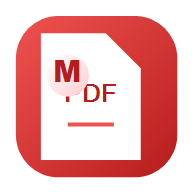
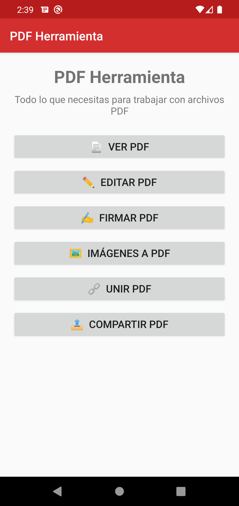
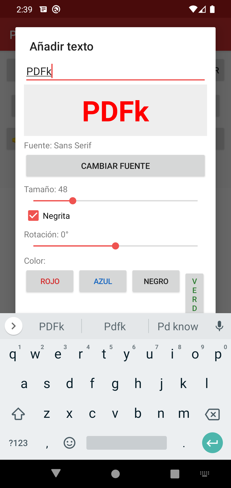
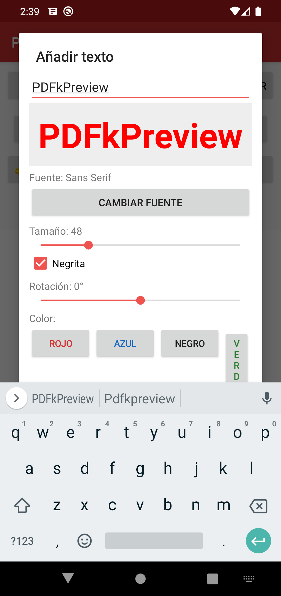
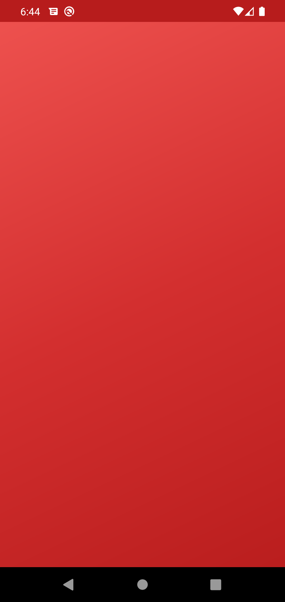
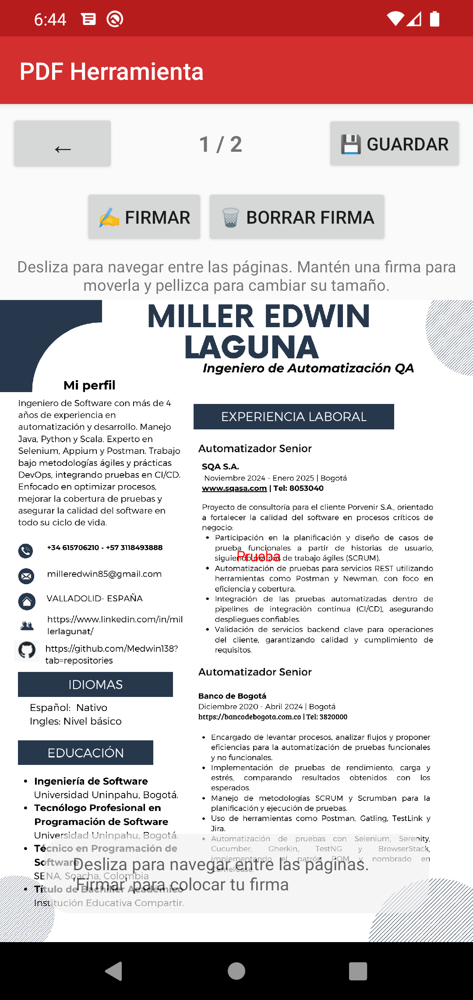
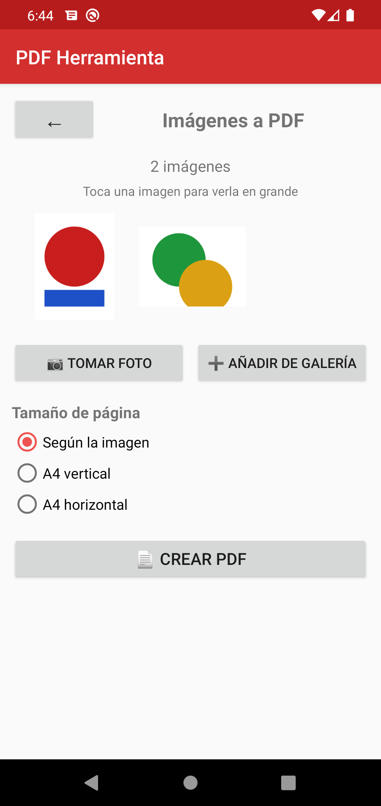
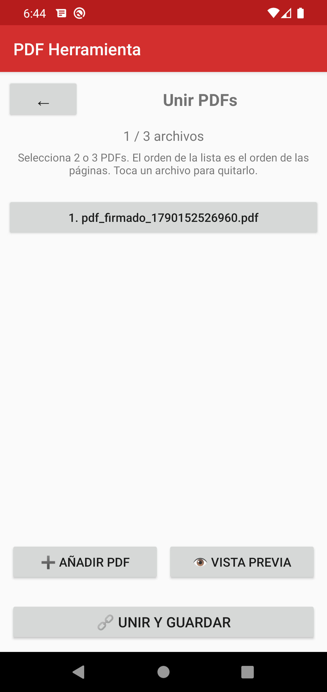
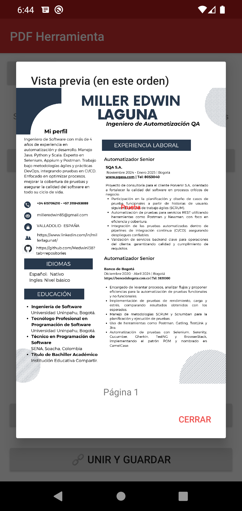

<div align="center">



# 🗂️ PDF Herramienta

**Editor, visor y utilidades para PDF en Android**

Versión **v3.0** · Aplicación nativa Android en **Kotlin**

<br>

[](https://github.com/Medwin138/pdf-herramienta/releases)
[](https://kotlinlang.org/)
[](#-compatibilidad)
[](LICENSE)
[](#-compatibilidad)

</div>

---

## 📸 Vista previa

| Menú principal | Editor de PDF | Diálogo de texto | Pantalla de carga |
|:---:|:---:|:---:|:---:|
|  |  |  |  |

| Firmar PDF | Imágenes a PDF | Unir PDF | Vista previa de unión |
|:---:|:---:|:---:|:---:|
|  |  |  |  |

---

## ✨ Funcionalidades

### 👁️ Visor de PDF
- Lectura fluida de documentos PDF directamente desde el equipo o desde cualquier proveedor de archivos del sistema.
- Diseñado para abrir cualquier PDF desde exploradores, correo o gestores de archivos (actividad exportada como visor por defecto).
- **Un mismo visor en toda la app**: el mismo componente (`EditorCanvasView`) se reutiliza para ver, editar y firmar, y para las **vistas previas** de Unir PDF e Imágenes a PDF, ofreciendo una experiencia de navegación idéntica (scroll libre, pinch-to-zoom anclado e indicador de página) en cada opción del menú.

### 📝 Editor de PDF
- **➕ Añadir texto**: escritura libre sobre cualquier punto del documento.
  - Vista previa en vivo con el texto, fuente, tamaño, color y rotación antes de colocar.
  - **8 fuentes** incluidas (Sans Serif, Serif, Monospace, Dancing Script, Oswald, Bebas Neue, Playfair Display, Raleway).
  - Tamaño ajustable, estilo **negrita**, **6 colores** y **rotación** de −180° a +180°.
- **✏️ Dibujar**: trazo libre con pincel y selección de color (rojo, azul, negro y más).
- **🧽 Borrar**: pincel blanco para ocultar texto o dibujos existentes.
- **🔍 Detectar texto**: reconocimiento del texto real del PDF (extraído con PDFBox) — al tocar sobre una palabra se abre automáticamente el diálogo de texto **prellenado con el texto, la fuente y el tamaño detectados**, para reescribirlo igual.
- **👆 Mover**: arrastra el documento (pan) y haz *pinch-to-zoom* con zoom anclado al punto de la pinza.
- **🖐 Navegación libre**: desplázate por **todas las páginas** con scroll vertical; el indicador de página se actualiza automáticamente al cambiar de página.
- **💛 Resaltar y 〰 subrayar** el contenido con color y subrayado horizontal.
- **📐 Formas y cajas**: línea, flecha, rectángulo, elipse y caja de texto — arrastra o redimensiona cada elemento.
- **📚 Librería de firmas**: guarda firmas usadas y colócalas de nuevo al instante, con gestión de la librería (listar, eliminar y vaciar).
  - La firma colocada se puede **mover con un dedo** y **redimensionar con pellizco** (dos dedos).
- 🔄 Girar: rotación del contenido.
- **↩ Deshacer** para controlar las ediciones.
- **💾 Guardar**: exporta el documento editado a un PDF nuevo en Descargas.

### ✍️ Firmar
- Dibujo de firma manuscrita sobre una pad dedicada.
- **Colocación de la firma** sobre el documento con arrastre y redimensionado con uno o dos dedos, y zoom anclado integrado.
- **Visor de todas las páginas**: el documento se abre en un visor con **navegación libre** (desplázate por todas las páginas con scroll vertical) y el indicador de página se actualiza automáticamente.
- Coloca tantas firmas como quieras en cualquier página, **borra** la seleccionada y guarda el PDF firmado directamente en Descargas.

### 🖼️ Imágenes a PDF
- Convierte una o varias imágenes en un documento PDF de forma rápida.
- **Añade de la galería** en bloque o **toma una foto con la cámara** para incluirla al instante.
- **Vista previa en grande** al tocar cada miniatura, y opción de **quitar** imágenes antes de crear el PDF.
- Elige el tamaño de página (según la imagen, A4 vertical u horizontal).

### 🔗 Unir PDF
- Combina **2 o 3 documentos PDF** en uno solo, en el orden seleccionado.
- **Vista previa en vivo** del resultado (todas las páginas, en orden) con el comportamiento del visor de PDF antes de guardar.

---

## 🤖 Compatibilidad

| Característica | Especificación |
|:---|:---|
| **Versión mínima de Android** | **Android 6.0 (Marshmallow, API 23)** |
| **Versión objetivo** | Android 10 (API 29) |
| **Compilación (SDK)** | API 29 |
| **Idioma** | Español |
| **Arquitectura** | Basado en **PdfRenderer** de Android y **PDFBox-for-Android** |

> Compatible con **cualquier dispositivo Android 6.0 o superior**, incluidos equipos de gama baja y alta.

---

## 🛠️ Tecnologías

- **Kotlin 1.3.72** — lenguaje principal.
- **Android Gradle Plugin 3.5.3** y **Gradle 6.1.1**.
- **PdfRenderer** (Android nativo) — renderizado de páginas.
- **[pdfbox-android](https://github.com/TomRoush/PdfBox-Android)** 2.0.24 — extracción de texto y unión de PDFs en Android.
- **Material Components** para la interfaz.
- **MultiDex** habilitado para compatibilidad con la librería de PDF.

---

## 🚀 Compilar

### Requisitos
- **JDK 11** (por ejemplo, Eclipse Adoptium Temurin).
- **Android SDK** con `platforms;android-29` y `build-tools;29.0.2`.

### Pasos
```bash
# 1. Configura tu JDK 11
export JAVA_HOME=/ruta/a/jdk-11
export PATH=$JAVA_HOME/bin:$PATH

# 2. Compila el APK de depuración
./gradlew assembleDebug

# 3. El APK quedará en
app/build/outputs/apk/debug/app-debug.apk
```

> En Windows:
> ```powershell
> $env:JAVA_HOME = "C:\Program Files\Eclipse Adoptium\jdk-11.0.32.101-hotspot"
> $env:PATH = "$env:JAVA_HOME\bin;" + $env:PATH
> .\gradlew.bat assembleDebug
> ```

---

## ⚠️ Nota importante sobre PDFBox

La librería **`org.apache.pdfbox:pdfbox`** (Oracle) **no es compatible con Android** porque referencia `java.awt.*`, clases que no existen en la plataforma. Por eso este proyecto usa el port **[`com.tom-roush:pdfbox-android`](https://github.com/TomRoush/PdfBox-Android)**, que conserva los mismos paquetes `com.tom_roush.pdfbox.*` y se inicializa con `PDFBoxResourceLoader.init(applicationContext)` al arrancar la aplicación.

---

## 📦 Estructura del proyecto

```
PDFHerramienta/
├── app/
│   ├── src/main/
│   │   ├── java/com/myproyect/pdfherramienta/
│   │   │   ├── MainActivity.kt          # Menú principal
│   │   │   ├── PdfViewerActivity.kt     # Visor de PDF
│   │   │   ├── PdfEditorActivity.kt     # Editor de PDF
│   │   │   ├── EditorCanvasView.kt      # Lienzo del editor (modos, zoom, texto)
│   │   │   ├── SignActivity.kt          # Firmar documentos (visor con EditorCanvasView)
│   │   │   ├── SignaturePadView.kt      # Pad de firma manuscrita
│   │   │   ├── ImagesToPdfActivity.kt   # Imágenes a PDF (galería y cámara)
│   │   │   ├── MergePdfActivity.kt      # Unir PDF (hasta 3, con vista previa)
│   │   │   ├── TextoReconocimiento.kt   # Extracción de texto con PDFBox
│   │   │   └── SplashActivity.kt        # Pantalla de inicio
│   │   ├── res/layout/                  # Interfaces de usuario
│   │   └── assets/fonts/                # Fuentes incluidas (Google Fonts, OFL)
│   └── build.gradle
├── docs/screenshots/                    # Capturas de la app
├── build.gradle
└── gradlew.bat
```

---

## 🌿 Estrategia de ramas

Este repositorio usa un flujo de trabajo con ramas:

| Rama | Propósito |
|:---|:---|
| `main` | Código estable, listo para producción. Solo recibe merges de `develop` (o *hotfixes*). |
| `develop` | Integración continua de funcionalidades en desarrollo. |
| `feature/*` | Funcionalidades nuevas o experimentales; se integran en `develop`. |

```
main        ●───────────────► (estable)
              \
develop      ●──●──●────────►
                 \  \
feature/x       ●───●──────► (se integra en develop)
```

---

## 👨‍💻 Desarrollador

Proyecto creado y mantenido por **Miller**, desarrollador independiente de aplicaciones Android bajo el sello **Miller Studio**.

- 📱 Especializado en herramientas sencillas, útiles y en español para el día a día.
- 🎨 Diseño cuidado con atención a los detalles de la interfaz.
- 🔗 Repositorio del proyecto en [github.com/Medwin138/pdf-herramienta](https://github.com/Medwin138/pdf-herramienta).

---

## 📄 Licencia

Publicado bajo la **Licencia MIT** — consulta el archivo [LICENSE](LICENSE) para más detalles.

Este proyecto es de **uso libre** para fines personales, educativos y comerciales.

<p align="center">
  <sub>Hecho con ❤️ para Android · Kotlin · PdfRenderer · PDFBox-for-Android</sub>
</p>